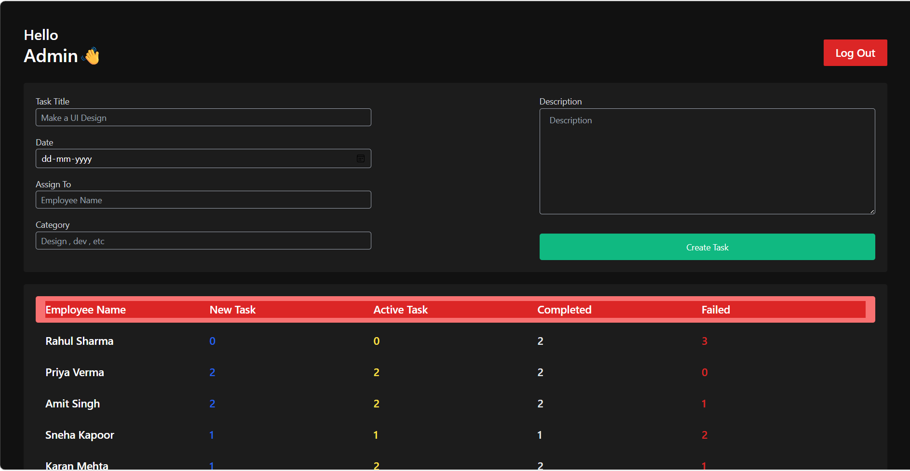
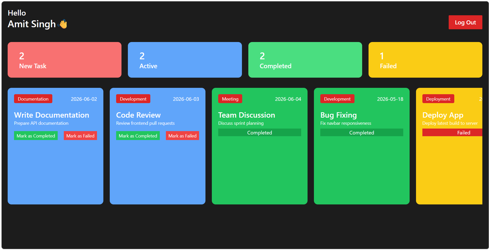

<p align="center">

</p>

<h1 align="center">
👨‍💼 HRMS - Employee Management Platform
</h1>

<p align="center">
A modern Human Resource Management System (HRMS) built with the MERN Stack that streamlines employee management, task allocation, authentication, and workflow monitoring through dedicated Admin and Employee dashboards.
</p>

<p align="center">


</p>

---

# 📖 Overview

Managing employees manually becomes inefficient as organizations grow.

This project provides a centralized platform where administrators can manage employees, assign work, monitor progress, and maintain organizational records, while employees can access their dashboards, manage assigned tasks, and update work status.

The application follows a scalable MERN architecture with a clean and responsive user interface.

---

# ✨ Key Features

## 👨‍💼 Admin Dashboard

- Employee Management
- Add New Employees
- Assign Tasks
- Monitor Employee Progress
- View Employee Information
- Manage Organization Workflow

---

## 👨‍💻 Employee Dashboard

- Personal Dashboard
- View Assigned Tasks
- Update Task Status
- Track Work Progress
- Manage Profile

---

# 🚀 Highlights

- ✅ Modern Dashboard UI
- ✅ Role-Based Authentication
- ✅ Employee Workflow Management
- ✅ Task Assignment System
- ✅ Responsive Design
- ✅ REST API Architecture
- ✅ Scalable MERN Stack
- ✅ Clean Folder Structure

---

# 🛠 Tech Stack

| Category | Technologies |
|------------|------------------------------|
| Frontend | React.js, JavaScript, CSS |
| Backend | Node.js, Express.js |
| Database | MongoDB |
| Authentication | JWT |
| API Testing | Postman |
| Version Control | Git & GitHub |

---

# 📸 Application Preview

## 👨‍💼 Admin Dashboard

<p align="center">

</p>

---

## 👨‍💻 Employee Dashboard

<p align="center">

</p>

---

# 🏗️ System Architecture

```text
                React Frontend
                      │
                      ▼
               Express REST APIs
                      │
      ┌───────────────┼───────────────┐
      ▼               ▼               ▼
 Authentication    Business Logic    Task Management
                      │
                      ▼
                  MongoDB Database
```

---

# 📂 Folder Structure

```text
HRMS-Employee-Management-Platform/

client/
│
├── components/
├── pages/
├── context/
├── assets/
└── utils/

server/
│
├── controllers/
├── middleware/
├── models/
├── routes/
├── config/
└── utils/

screenshots/

README.md
```

---

# ⚙️ Installation

## Clone Repository

```bash
git clone https://github.com/sparshdwivedi19/HRMS-Employee-Management-Platform.git
```

---

## Frontend

```bash
cd client

npm install

npm run dev
```

---

## Backend

```bash
cd server

npm install

npm run dev
```

---

# 🔑 Environment Variables

Create a `.env` file inside the server directory.

```env
PORT=

MONGO_URI=

JWT_SECRET=
```

---

# 🚀 Future Enhancements

- Email Notifications
- Attendance Management
- Payroll Module
- Leave Management
- Employee Performance Analytics
- Department Management
- Calendar Integration
- AI-based Performance Insights
- Document Management
- HR Reports Dashboard

---

# 📚 Learning Outcomes

During this project I gained hands-on experience in:

- Full Stack MERN Development
- REST API Design
- MongoDB Database Modeling
- JWT Authentication
- Dashboard Development
- Component-Based React Architecture
- Backend Routing & Middleware
- CRUD Operations
- Real-world HRMS Workflow Design

---

# 🤝 Contributing

Contributions are welcome!

1. Fork the repository

2. Create a new feature branch

```bash
git checkout -b feature/NewFeature
```

3. Commit your changes

```bash
git commit -m "feat: add new feature"
```

4. Push to your branch

```bash
git push origin feature/NewFeature
```

5. Open a Pull Request

---

# 👨‍💻 Developer

## Sparsh Dwivedi

🎓 B.Tech Computer Science & Engineering

🏫 IIITDM Jabalpur

### Connect with Me

- GitHub: https://github.com/sparshdwivedi19
- LinkedIn: *(Add Your LinkedIn URL)*
- Portfolio: *(Add Your Portfolio URL)*
- Email: *(Add Your Email Address)*

---

# ⭐ Support

If you found this project helpful, please consider giving it a ⭐ on GitHub.

It motivates me to build more real-world software projects.

<p align="center">

Made with ❤️ using React • Node.js • Express.js • MongoDB

</p>
